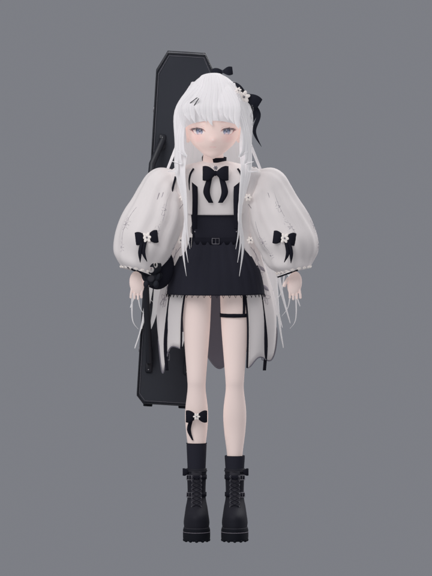

# 月白花徑 · Sakura Sprint

和月白結一起跑過月光、櫻花、水面倒影與旋律交織的 3D 花徑。

**[直接遊玩](https://sion-rgb.github.io/sakura-sprint/)**

## 遊玩

- 左右方向鍵 / A、D：轉換跑道。
- 空白鍵 / 上方向鍵 / W：跳躍。
- Esc / P：暫停及繼續。
- 手機可滑動或使用畫面下方按鈕。
- 音樂按鈕控制背景音樂與音效；開始旅程後播放《Sunny Hillside Dash》，循環播放並記住靜音選擇。
- 「細看月白結」可旋轉角色、查看臉部特寫及示範跑步。

## 2026-09-18 角色重建

以提供的月白結設定圖作為設計基準，重建五官、分層銀白長髮、髮飾、白色寬袖外套、黑裙、腿飾及厚底短靴，保留獨立琴盒與黑貓吊飾。袖面花枝、袖口褶邊、鞋帶和扣飾使用實際幾何結構。

已移除會隨鏡頭切換的插畫投影。臉部使用固定 UV，衣服與四肢使用分區權重，配有 28 根骨骼與 Idle、Run、Jump 三段動作。跳躍動作配合遊戲的起跳與落地時間；角色展示使用獨立柔光。

這是簡化的遊戲重建版。髮束、衣褶、刺繡密度及神情仍未達到原設定圖的精緻程度，並非逐項完整還原或商用角色品質。



場景包含櫻花樹、月光水道、鐵欄、暖色路燈、石板路、遠景建築、花瓣與音符；原背景音樂完整保留。

## 驗證

- 匯出 GLB：固定 UV、骨骼權重、三段動畫、循環接合與雙腳離地高度檢查。
- Three.js r170：每段動作取 33 個時點檢查蒙皮；臉部 UV 與比例保持不變。
- 實際瀏覽器：確認載入、正側面與近鏡、跑步展示、左右換道、跳躍、暫停與恢復、音符收集、碰撞結束及背景音樂狀態；測試期間未記錄到 console error / warning。
- 匯出模型 370,002 三角面、31 個材質圖元、約 16.6 MB。未聲稱手機實機流暢度或固定幀率通過測試。

## 本機啟動

需要 Python 3。於專案目錄執行：

```sh
python -m http.server 5173 --directory dist
```

開啟 `http://localhost:5173`。遊戲無需建置或 API 金鑰。

## 檔案

- `dist/`：完整遊戲與 Three.js r170 模組。
- `dist/yui-rebuilt.glb`：含材質、固定 UV、骨架與三段動畫的網頁模型。
- `models/Yui-Rebuilt.blend`：已封裝貼圖的 Blender 5.1 可編輯原檔。
- `models/validation/`：模型與動畫檢查記錄。
- `ASSETS.md`：素材來源與製作說明。

GitHub Actions 將 `dist/` 發佈至 GitHub Pages。
