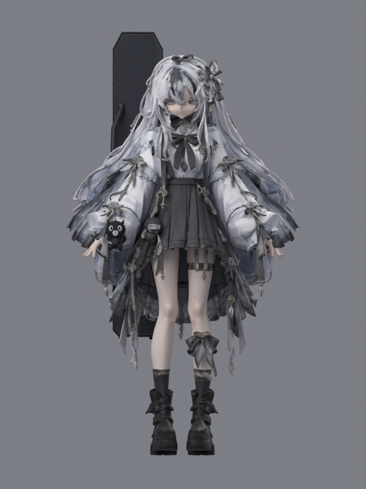

# 月白花徑 · Sakura Sprint

本分支恢復使用者指定的歷史模型，保留原臉、髮型、身形、服裝表面及原貼圖，另加骨架、琴盒與黑貓。

**獨立修復候選版。正式網站仍是 main；神情與美術還原度尚未完成驗收。**

使用者選中的第二張截圖與歷史 `Generated-Review/view-180.png` 解碼像素完全一致，原模型為 `Yui-Generated-Unreviewed.glb`。Unreviewed 是歷史檔名；現在選用它依照使用者的明確指定。

## 本機檢視

在此分支目錄執行 `python -m http.server 5173`：

- `http://localhost:5173/selected-review/`：歷史截圖、正面、近鏡、側面、跑姿與原設定圖。
- `http://localhost:5173/dist/`：遊戲及角色展示，含獨立眼部細修。
- `http://localhost:5173/dist/?eyes=original`：同一骨架及配件，關閉眼部細修，對照原模型。

方向鍵 / A、D 換道；空白鍵 / W 起跳；P / Esc 暫停；觸控按鈕亦可操作。音樂按鈕控制使用者提供的《Sunny Hillside Dash》。

## 保留與修改

- 原表面 838,905 頂點、1,013,358 三角面；位置與 UV 雜湊前後一致。
- 原 GLB 兩張內嵌影像在新匯出檔內逐位元相同。
- 17 根適配骨骼及 Idle / Run / Jump；連通腿部表面與衣髮分開配重。
- 琴盒、背帶、黑貓均為獨立附件。
- 五官細修是獨立 `yui-eye-detail.glb`，只使用原設定圖的眼睛與短嘴線像素，固定 UV，貼合原眼窩及嘴部並掛於原 Head 骨。沒有重新生成五官、替換頭部或改動原眼形網格。
- 場景、遊戲規則、音樂及舊 Rebuilt 資產保留。

## 驗證與限制

`node validate-selected.mjs` 使用專案 Three.js r170，對每段動作取 33 個時間點，核對原影像、固定 UV、臉部剛性和腳底高度。瀏覽器實測另存於 `selected-review/browser-validation.json`，不以 CPU 測試替代 WebGL 驗證。

渲染證據見 `selected-review/`。基礎候選 GLB 約 66.8 MB、含附件 1,029,872 三角面；局部五官補層另增 1,728 三角面。沒有宣稱手機實機或固定幀率驗收通過。

原模型仍有粗糙的局部雕塑和貼圖細節。眼部局部補層可辨认瞳孔，但不代表神情、髮絲及插畫精緻度完全等同於設定圖。完整美術任務仍為 **PARTIAL**。

## 可編輯來源及重建

- `models/Yui-Selected-Source.glb`：逐位元保存的歷史原模型。
- `models/Yui-Selected-Rigged.blend`：封裝貼圖、適配骨架及配件的 Blender 5.1.2 原檔。
- `dist/yui-selected.glb`：原表面加骨架與附件。
- `dist/yui-eye-detail.glb`：可獨立移除的眼睛與短嘴線補層。
- `SELECTED-BASE.md`：來源及回歸記錄。

Blender 5.1.2 背景模式依序執行 `inspect-selected.py`、`segment-selected.py`、`build-selected.py`、`study-eye-detail.py`；再用 Python 執行 `stage-selected.py` 更新資產雜湊與快取版本，最後執行 Node 驗證。來源與附件均在本分支內。來源 Blend、分區暫存及眼部研究 Blend 可重建，不納入 Git。

正式 Pages 由 main 的 GitHub Actions 發布。本修復分支不等同於正式部署。
