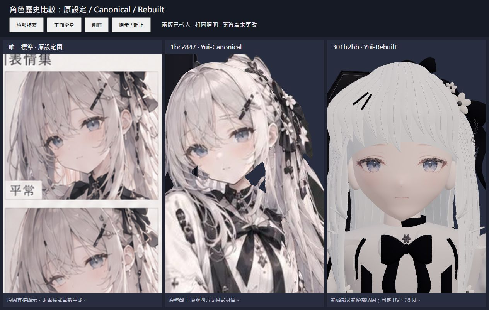
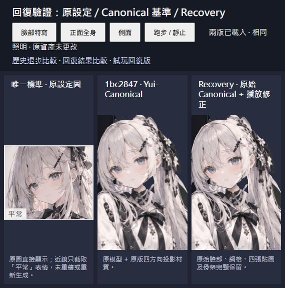
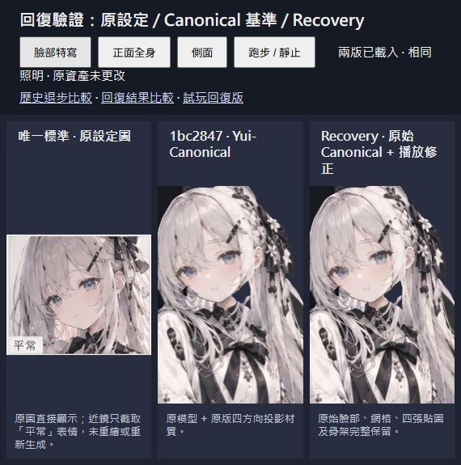
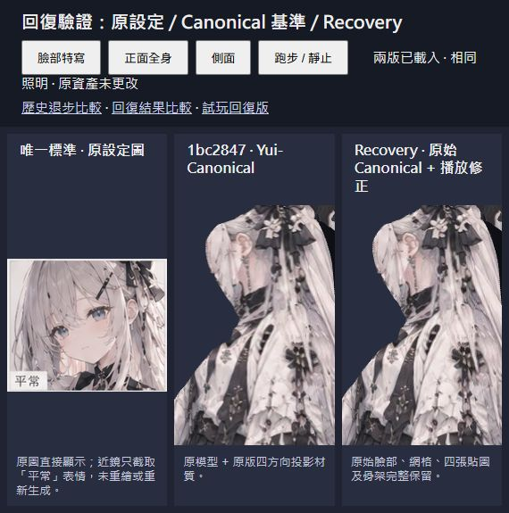

# Yui identity recovery — 2026-09-24

## Evidence and minimum change

History was inspected before any character edit. `1bc2847` was compared directly with `301b2bb`, including the actual browser projection shader: a plain GLB render would not reproduce the old Canonical appearance.

An isolated worktree and branch, `codex/yui-identity-recovery-20260924`, was created from `301b2bb` before recovery. The original `sakura-sprint` checkout and both Rebuilt model files were not overwritten. An additional archive of `1bc2847` was saved outside this worktree.

The regression is in `301b2bb:dist/yui-rebuilt.glb`, backed by `models/Yui-Rebuilt.blend`:

| Component | Canonical, `1bc2847` | Rebuilt, `301b2bb` |
|---|---|---|
| Mesh | `geometry_0`, original posed surface | `Yui head - continuous jaw and cheek surface`, a different head and joined procedural outfit |
| Face treatment | `Yui illustration \| front` and existing four-view paint | `Yui face - painted fixed UV` |
| Images | `front`, `back`, `side`, `left` | new `Yui-Face-BaseColor-v1` |
| Rig | 17 bones fitted to the asymmetric posed mesh | 28 bones fitted to another body/rest pose |
| Visible change | angled eyes, reserved expression, wispy fringe, illustrated clothing | different eyes/jaw/mouth, straight fringe and greatly simplified outfit |

The exact regression and proposed minimum repair were shown to the user before changing the branch's active character.

Recovery restores the **existing Canonical assets**, without generating or retouching a face. The mesh, UVs, embedded paint, weights, rest pose and animation tracks are byte-identical to `1bc2847`. This is an identity rollback, not a substitute character built to repair UVs or animation.

The browser controller retains only the safe playback changes from `301b2bb`: single-play Jump with restart, 0.78-second flight timing, non-warping cross-fades and bounded delta time. Rebuilt's independent inspection lighting is retained; the Canonical illustration shader is unlit, so this does not relight the painted face. The close-up framing is restored for the Canonical head height. Game environment, music and gameplay are retained.

The 28-bone rig and new fixed-UV face were **not transferred**: they belong to different geometry and would change the silhouette, expression or rest pose. Both remain intact as inactive checkpoint assets.

## Visual regression review

Final front, close-up and running close-up were rendered in the browser and visually compared with the original setting sheet and the actual historical Canonical renderer. The original sheet is authoritative; its “normal” expression is displayed directly as a crop, not repainted.

Observed recovery: the previous eye contours and highlights, small mouth, angled face, cheek treatment, fringe and illustrated hair/garment details return. The gentle, reserved expression follows the existing Canonical paint; no sleepy/depressed expression was substituted. The Canonical and recovered front-face appearances match by inspection. This does **not** claim that Canonical itself is a perfect match to the setting or that the user has approved it.

## Remaining defects

- Existing Canonical neck/cheek gaps remain visible in the final close-up.
- Camera-dependent projection seams and distortion remain at oblique angles. Fixed UVs were not reintroduced by replacing the face again.
- The original Run is conservative. Jump is a held airborne pose; the controller fixes playback, not the pose's artistic quality.
- The sampled head/front region includes hair and mixed weights. Measured pairwise drift is about 0.29 mm in Idle and 0.37 mm in Run; this is inherited, not evidence of a fully rigid face.

## Checks and scope

- Hash checks match both Canonical GLB/Blender files to `1bc2847`, and untouched Rebuilt GLB/Blender files to `301b2bb`.
- The setting image, music and environment remain unchanged (text line endings normalized for the environment comparison).
- Actual Three.js r170 loader, mixer and CPU skinning: 33 samples per clip, finite deformations, original rig, single-play Jump hold and restart checked. Jump's static pose is recorded explicitly.
- Browser: 17 bones, 11 mesh primitives, 135,052 triangles, three clips; front/close/run/side reviewed, lane change and airborne Jump observed, landing, pause/resume, music time advancement, collection and collision state observed. No console warnings or errors were recorded.
- Technical results: `models/recovery-validation/technical.json`; browser evidence: `models/recovery-validation/browser.json`.
- Existing `models/validation/` results are historical Rebuilt evidence and are not reused as recovery validation.

**Status:** appearance-recovery candidate, with known historical defects. Main and GitHub Pages are not replaced by this branch. No claim of complete production-quality model repair or final artistic approval is made.
